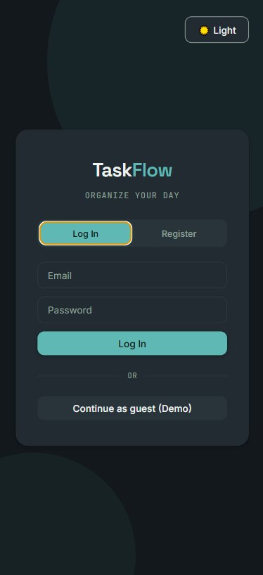
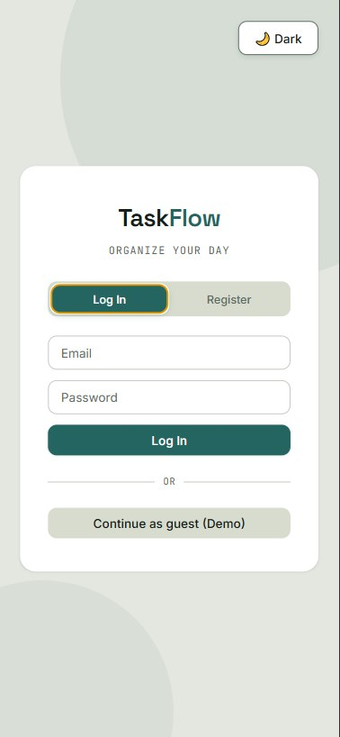
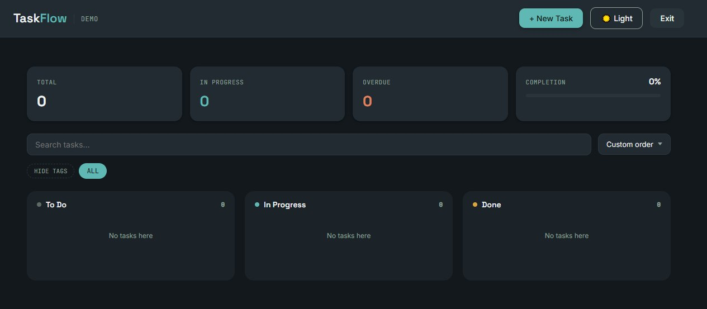

# TaskFlow
 
A task management app with a kanban board, drag & drop, tags, subtasks, and a dark/light theme — built with Vue 3, TypeScript, and Supabase.
 
**[Live Demo](https://taskflow-bygray.netlify.app)** — click *"Continue as guest"* to explore without signing up.
 

 




 
## Features
 
- 🔐 **Auth** — email/password sign up & login, guest demo mode, protected routes
- 📋 **Kanban board** — three columns (To Do / In Progress / Done) with drag & drop, both between columns and for manual ordering within a column
- ✅ **Subtasks** — break a task down into checkable steps, tracked with a progress count
- 🏷️ **Tags & search** — filter tasks by tag, full-text search across title and description
- 🔃 **Sorting** — by creation date, deadline, priority, or custom manual order
- 🌗 **Dark / light theme** — persisted across visits, with accessible focus states
- 📱 **Responsive** — usable on mobile, though drag & drop is currently desktop-only (see [Known limitations](#known-limitations))
## Tech stack
 
| Layer          | Tech                                      |
|----------------|--------------------------------------------|
| Framework      | Vue 3 (`<script setup>`, Composition API) |
| Language       | TypeScript                                |
| State          | Pinia + custom singleton composables      |
| Routing        | Vue Router 4 (with navigation guards)     |
| Backend        | Supabase (Postgres, Auth, Row Level Security) |
| Build tool     | Vite                                      |
| Styling        | Plain CSS with custom properties (no framework) |
| Hosting        | Netlify                                   |
 
## Architecture
 
The codebase follows a simplified **Feature-Sliced Design** layout:
 
```
src/
├── app/          # router setup
├── pages/        # route-level components (thin, composition only)
├── widgets/       # large composed blocks (e.g. TaskBoard)
├── features/      # user actions (auth form, task creation)
├── entities/      # domain logic (Task, User — composables + types)
└── shared/        # reusable UI kit, API client, composables
```
 
Data access is wrapped in composables (`useTasks`, `useAuth`) that expose a small set of async actions and reactive state — components never talk to Supabase directly.
 
Security is enforced at the database level: every table has Row Level Security policies scoped to `auth.uid()`, so access control doesn't rely on the frontend.
 
## Getting started
 
```bash
git clone https://github.com/GrayMurakami/taskflow.git
cd taskflow
npm install
```
 
Create a `.env` file in the project root:
 
```
VITE_SUPABASE_URL=your_supabase_project_url
VITE_SUPABASE_ANON_KEY=your_supabase_anon_key
VITE_DEMO_EMAIL=demo_account_email
VITE_DEMO_PASSWORD=demo_account_password
```
 
You'll need your own [Supabase](https://supabase.com) project with a `tasks` table (see schema below) and RLS policies enabled.
 
```bash
npm run dev
```
 
### Database schema
 
```sql
create table tasks (
  id uuid primary key default gen_random_uuid(),
  user_id uuid references auth.users(id) on delete cascade,
  title text not null,
  description text,
  priority text not null default 'medium',
  status text not null default 'todo' check (status in ('todo', 'inprogress', 'done')),
  tags text[] not null default '{}',
  subtasks jsonb not null default '[]',
  deadline timestamptz,
  created_at timestamptz not null default now(),
  "order" integer not null default 0
);
```
 
Enable Row Level Security and add policies restricting `select` / `insert` / `update` / `delete` to rows where `auth.uid() = user_id`.
 
## Known limitations
 
- Drag & drop uses the native HTML5 Drag and Drop API, which doesn't support touch devices — reordering on mobile isn't available yet.
- Manual ordering uses fractional insertion (`order - 0.5` between neighbors); extremely frequent reordering of the same pair of tasks could theoretically hit floating-point precision limits over a very long session.
## Roadmap
 
- [ ] Touch-friendly drag & drop for mobile
- [ ] Automated tests (Vitest + Vue Test Utils)
- [ ] Task editing (currently create/delete/status only)
## License
 
MIT
